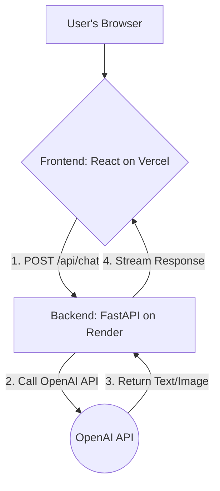

---
### **Project Overview: ATLAS**

---

### 1. Project Goal & Core Problem

**Project Goal:** To build a conversational AI assistant named ATLAS that acts as a creative partner for TTRPG Dungeon Masters.
**Core Problem:** Dungeon Masters face significant creative burdens and time commitments for session preparation, leading to burnout. Existing tools are fragmented and lack the dynamic, conversational flow needed for true creative brainstorming and on-the-fly improvisation.

---

### 2. MVP Scope & Key Features

**Features IN Scope for MVP (Week 13 Demo):**
*   **Conversational AI Core:** A web-based chat interface for interacting with the AI assistant.
*   **Session-based Memory:** The AI will remember the context of the current conversation.
*   **Core Content Generation:** Create high-quality descriptions for NPCs, locations, and plot hooks.
*   **NPC Image Generation:** Generate visual portraits for created NPCs on demand.
*   **Improvisation Aid:** Provide quick, creative ideas for unexpected player actions.
*   **Essential UX:** Loading indicators and basic error handling.

**Features OUT of Scope for MVP:**
*   User Accounts & Authentication
*   Persistent Storage (saving conversations or content libraries)
*   Multiplayer Functionality
*   Complex Game Mechanics (dice rolls, stat blocks)
*   Advanced Content Generators (e.g., full dungeons, magic items)
*   Monetization or Subscription Features

---

### 3. Target Audience

The primary target users are **Tabletop Role-Playing Game (TTRPG) Dungeon Masters (DMs)** and Game Masters (GMs), ranging from novices seeking guidance to veterans looking to accelerate their creative workflow.

---

### 4. Technology Stack (Specific Versions)

| Category | Technology | Specific Version | Notes |
| :--- | :--- | :--- | :--- |
| Language | Python | 3.11.4 | For the backend service. |
| Backend Framework | FastAPI | 0.110.0 | Chosen for async support and performance. |
| Frontend Framework | React | 18.2.0 | Using Vite for the build tool. |
| AI API Library | OpenAI Python | 1.17.0 | For interacting with GPT-4o and DALL-E 3. |
| Testing (Backend) | Pytest | 8.1.1 | For unit and integration tests. |
| Testing (Frontend) | Vitest | 1.5.0 | For component unit tests. |
| Deployment (Frontend) | Vercel | N/A | Connected to GitHub for CI/CD. |
| Deployment (Backend)| Render | N/A | Connected to GitHub for CI/CD. |
| Version Control | Git | N/A | Repository hosted on GitHub. |

---

### 5. High-Level Architecture

**Architectural Style:** A stateless, client-server web application. The backend serves as a lightweight orchestrator for third-party AI services.

**Mermaid Diagram:**


---

### 6. Core Components/Modules

*   **Frontend:** Renders the chat UI, manages client-side state (conversation history, loading status), and communicates with the backend API.
*   **Backend:** Exposes the `/api/chat` endpoint, manages conversation context for the session, constructs prompts, and orchestrates calls to the OpenAI service.
*   **AI Service Module (Backend):** A dedicated Python module that contains all logic for interacting with the OpenAI API, including text generation, image generation, and streaming.

---

### 7. Key UI/UX Considerations

*   **Conversational Interface:** The entire user experience is centered around a simple, intuitive chat interface.
*   **Responsive Design:** The UI must be functional and readable on both desktop and tablet devices, as DMs often use tablets at the game table.
*   **Clarity & Focus:** Avoid clutter. The interface should prioritize the conversation, with clear loading states and unobtrusive buttons for actions like copying text.

---

### 8. Coding Standards & Quality Criteria

*   **Style Guide:** PEP 8 for Python; Airbnb JavaScript Style Guide for React.
*   **Formatter:** Black (Python); Prettier (JavaScript/React).
*   **Linter:** Ruff (Python); ESLint (JavaScript/React).
*   **Top 5 Quality Criteria Focus:** Reliability, Cost-Efficiency, User Experience, Maintainability, Testability.

---

### 9. Testing Strategy

*   **Required Test Types:** Unit Tests, Integration Tests, Manual End-to-End Tests.
*   **Testing Frameworks:** `pytest 8.1.1` (Backend), `Vitest 1.5.0` (Frontend).
*   **Minimum Code Coverage:** 80% for core backend logic (e.g., `ai_service.py`).
*   **Verification Approach:** A GitHub Actions workflow will run all automated tests on every pull request, blocking merges if tests fail.

---

### 10. Initial Setup Steps
```bash
# 1. Clone the repository
git clone https://github.com/[your-org]/atlas.git
cd atlas

# 2. Set up the backend
cd backend
python -m venv venv
source venv/bin/activate
pip install -r requirements.txt
cp .env.example .env
# Edit .env and add your OPENAI_API_KEY

# 3. Set up the frontend
cd ../frontend
npm install

# 4. Run the application (in two separate terminals)
# Terminal 1 (from /backend):
uvicorn app.main:app --reload
# Terminal 2 (from /frontend):
npm run dev
```

---

### 11. Key Architectural Decisions

*   **Backend Framework (FastAPI):** Chosen over Flask for its native `async` support, which is essential for efficiently streaming AI responses and improving user-perceived performance.
*   **Stateless Backend (for MVP):** We deliberately chose to avoid a database or session cache for the initial MVP to reduce complexity and focus on the core AI interactions. The client sends the context with each request.
*   **Primary AI Provider (OpenAI):** Chosen for its state-of-the-art model quality (GPT-4o, DALL-E 3), which is critical for our value proposition of being a high-quality creative partner.

---

### 12. Project Documentation

*   **Project Overview (This Doc):** `docs/prd-full.md`
*   **Architecture Diagram & Details:** `docs/architecture-v2.md`
*   **Feature Roadmap:** `docs/feature-roadmap.md`
*   **Evaluation Plan:** `docs/evaluation-plan-v2.md`
*   **Cost Model:** `docs/cost-model-v2.md`
*   **Team Health Checks:** `docs/team-health-week*.md`

---

### 13. Repository Link

`https://github.com/[your-org]/atlas`

---

### 14. Dependencies & Third-Party Services

*   **OpenAI API:** The core dependency for all generative features. Requires an API key.
    *   **Services Used:** GPT-4o for text, DALL-E 3 for images.
    *   **Rate Limits:** We will operate within the default Tier 1 limits.
*   **Vercel:** Hosting platform for our frontend.
*   **Render:** Hosting platform for our backend.

---

### 15. Security Considerations

*   **Authentication Method:** None for the MVP. The application is public.
*   **Data Protection:** No user data or PII is stored. All chat sessions are ephemeral.
*   **Key Security Risks & Mitigations:**
    *   **API Key Theft:** Mitigated by storing keys only in secure environment variables on the backend server. The key is never exposed to the client.
    *   **Prompt Injection:** Mitigated through robust system prompt engineering and by having no sensitive data for the AI to leak.
    *   **Denial of Service (Cost Overruns):** Mitigated by active monitoring of our OpenAI budget and usage dashboard.

---

### 16. Performance Requirements

*   **Response Time (Text):** API must deliver the first token of a response in **< 2 seconds (p95)**.
*   **Response Time (Image):** The full image must be generated and displayed in **< 13 seconds (p95)**.
*   **Resource Constraints:** The application must operate entirely within the free tiers of Vercel and Render. The total OpenAI API cost must stay within our allocated student credits budget.

---

### 17. Monitoring & Observability

*   **Logging Strategy:** Structured JSON logs for all backend API requests, including token counts, cost, and latency for each AI call.
*   **Monitoring Tools:** We will use the built-in dashboards on Vercel and Render to monitor uptime and basic traffic. The OpenAI dashboard will be used for real-time cost and usage monitoring.
*   **Key Metrics:** API latency, cost per session, daily spend, and server error rates.

---

### 18. Deployment & DevOps

*   **Deployment Strategy:** A push-to-deploy workflow. Any merge into the `main` branch on GitHub will automatically trigger a new deployment on both Vercel (frontend) and Render (backend).
*   **Environment Strategy:**
    *   **Development:** Local machines.
    *   **Staging:** Vercel's automatic preview deployments for every pull request.
    *   **Production:** The live application deployed from the `main` branch.
*   **CI/CD Pipeline:** A GitHub Actions workflow will be implemented to automatically run linters and unit tests on every pull request, blocking merges if checks fail.
