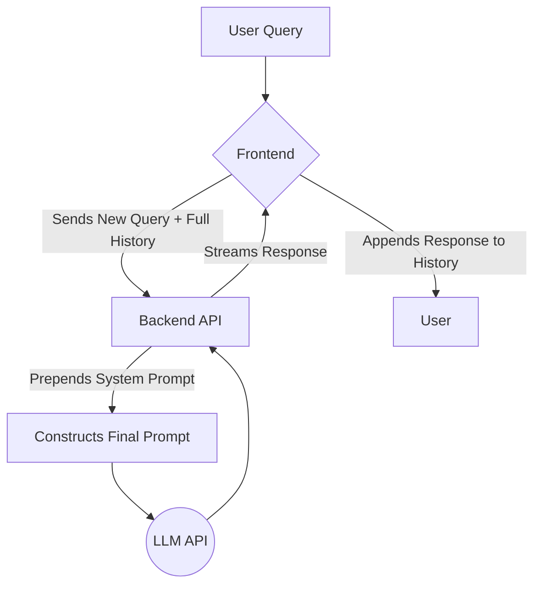

---
### **RAG Strategy**

**Team Name:** ATLAS Core Team
**Project:** ATLAS: A Conversational AI Assistant for Dungeon Masters
**Date:** Week 5, [Date]

---
### 1. Do We Need RAG?

**Decision:** ☐ YES, we're using RAG | ☒ **NO, we're not using RAG (for the MVP)**

**Reasoning:**
Our "Walk" phase MVP for ATLAS is designed as a **creative content generator**, not a knowledge retrieval system. Its primary function is to brainstorm novel ideas (NPCs, plots, locations) from scratch, based on the immediate conversational context. The "knowledge" it needs is the short-term memory of the current chat session, which is handled by passing the conversation history with each API call.

Retrieval-Augmented Generation (RAG) is a powerful technique for querying an existing corpus of documents. This will be **absolutely critical for our "Run" and "Fly" phases**, where we plan to allow users to upload their own campaign notes. However, for the MVP, implementing a RAG pipeline would add significant complexity (embedding, vector storage, chunking) without contributing to our core goal of demonstrating high-quality, on-the-fly creative generation. Our chosen alternative is a more direct and appropriate method for this specific use case.

---
### 2. Knowledge Sources

This section is not applicable for the MVP, as we are not using a static knowledge base. However, for future planning ("Run" phase), the following sources would be integrated:

**Future Source 1: User's Campaign Notes**
- **Type:** Markdown (`.md`) and Plain Text (`.txt`) documents.
- **Location:** User-uploaded files.
- **Quantity:** Varies per user (e.g., 5-50 documents).
- **Update Frequency:** Varies; updated by the user between sessions.
- **Content Description:** The DM's personal notes on their world, characters, plot points, and history.

---
### 3. RAG Architecture Choice

Since we are not implementing RAG for the MVP, we are using an alternative architecture.

☐ Option A: Traditional RAG
☐ Option B: Database RAG
☐ Option C: Hybrid RAG
☒ **Option D (Modified): No RAG (Contextual Conversation)**
```
User Query → Append to History → Inject History into Prompt → LLM → Response
```
**Our reasoning for choosing this:**
This is the most direct and efficient architecture for our creative use case. The core challenge is maintaining a fluid, creative conversation, which depends entirely on the immediate context of the chat history, not on retrieving external documents. This approach allows us to focus 100% of our effort on prompt engineering and conversational flow, which are the most important factors for the success of the MVP.

---
### 4. Technical Implementation

This section is not applicable for the MVP. However, for the future "Run" phase, our planned RAG stack is:
*   **Embedding Model:** `text-embedding-3-small` for its excellent balance of cost and performance.
*   **Vector Database:** `Chroma` for local development and initial testing, with a plan to migrate to a managed service like `Pinecone Serverless` for production.
*   **Chunking Strategy:** `RecursiveCharacterTextSplitter` with 1000 token chunks and a 200 token overlap to maintain semantic context.
*   **Retrieval Parameters:** Start with `Top K = 3` to provide focused context without overwhelming the LLM.

---
### 5. Citation Strategy

Not applicable for the MVP. ATLAS generates original content and does not cite external sources.

---
### 6. RAG Evaluation Plan

Not applicable for the MVP. The quality of our conversational context is evaluated via our main **Evaluation Plan (docs/evaluation-plan-v2.md)**, specifically through the "memory" test case (E003) in our Golden Set and user testing.

---
### 7. Alternative Approaches (If Not Using RAG)

#### How We're Accessing Knowledge/Data Instead
Our application's "knowledge" is the conversation itself. We use a **Contextual Conversation** pattern:
1.  The frontend maintains the full list of messages (user and AI) for the current session.
2.  When the user sends a new message, the entire history is sent to the backend.
3.  The backend takes this history, combines it with the system prompt, and sends it as a single, context-rich package to the LLM.
4.  This allows the LLM to "remember" previous parts of the conversation and generate responses that are coherent and relevant.

#### Why This Is Better for Our Project (for the MVP)
*   **Aligns with Core Goal:** Our goal is creativity, not factual retrieval. Conversational context is what fuels creative brainstorming.
*   **Reduces Complexity:** It eliminates the need for a full RAG pipeline (ingestion, chunking, embedding, vector storage), which would be a significant engineering effort.
*   **Lower Cost for MVP:** We avoid the costs associated with embedding millions of tokens and paying for a vector database service.
*   **Focuses Effort:** It allows us to concentrate on the most important part of our project: prompt engineering and the quality of the AI's persona and creative output.

---
### 8. Implementation Timeline

Not applicable for a RAG-specific implementation. The implementation of our Contextual Conversation pattern is part of our core feature development from Week 5 to Week 7.

---
### 9. Risks and Mitigations (for our chosen Contextual Conversation approach)

#### Risk 1: Exceeding Context Window
**Symptom:** The conversation gets very long, and API calls start failing with a "context window exceeded" error.
**Mitigation:**
- [x] **Implement Truncation:** The backend will calculate the token count of the history and automatically remove the oldest messages (after the system prompt) to ensure the payload always fits.
- [ ] **(Future) Implement Summarization:** A more advanced mitigation where the oldest part of the conversation is summarized by a cheaper LLM, preserving its key points with fewer tokens.

#### Risk 2: High Costs in Long Sessions
**Symptom:** As the conversation history grows, the input token count for every single turn increases, driving up costs.
**Mitigation:**
- [x] **Context Summarization** (as above) is the primary mitigation.
- [ ] **Hybrid Model Selection:** Use a cheaper model (GPT-4o-mini) for simple follow-up questions that don't require the full creative power of GPT-4o.

---
### 10. Resources and References

**Libraries/Tools We're Using:**
*   `openai` Python SDK: For all interactions with the LLM.
*   `tiktoken`: To accurately count tokens for our truncation and cost-tracking logic.

**Team Members Responsible:**
*   Context Management: [Backend Lead]
*   Prompt Engineering: [AI/Visuals Lead]
*   Evaluation: All team members.

---
### Appendix: Contextual Conversation Architecture Diagram

---
### Sign-off

**Team Members:**
- Davit Datunashvili
- [Member 2 Name]
- [Member 3 Name]

**Date Completed:** 11/6/2025
